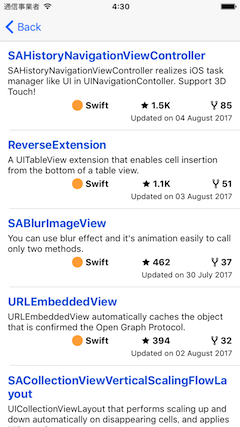

# GithubKitForSample

This is a simple Github API client and UI to use in sample projects.

## Requirements

- Xcode 10.1
- Swift 4.2
- iOS 11.0
- carthage 0.31.2
- [RxSwift](https://github.com/ReactiveX/RxSwift) 4.4.0
- [SwiftIconFont](https://github.com/0x73/SwiftIconFont) 3.0.0
- [Nuke](https://github.com/kean/Nuke) 7.5.2

## Installation

You can install via Carthage.

```ruby: Cartfile
github "marty-suzuki/GithubKitForSample"
```

You can install via Cocoapods.

```ruby: Cartfile
pod 'GithubKitForSample', :git => 'https://github.com/marty-suzuki/GithubKitForSample.git'
```

## Usage

```swift
import GithubKit

ApiSession.shared.token = "/* Your Token */"

/// - note: You can search users.
let request = SearchUserRequest(query: "marty-suzuki", after: nil)
ApiSession.shared.send(request) {
    switch $0 {
    case .success(let value):
        //
    case .failure(let error):
        //
    }
}

/// - note: You can fetch user's repositories.
let request = UserNodeRequest(id: user.id, after: nil)
ApiSession.shared.send(request) {
    switch $0 {
    case .success(let value):
        //
    case .failure(let error):
        //
    }
}
```

## Layout

### UserViewCell


### RepositoryViewCell

